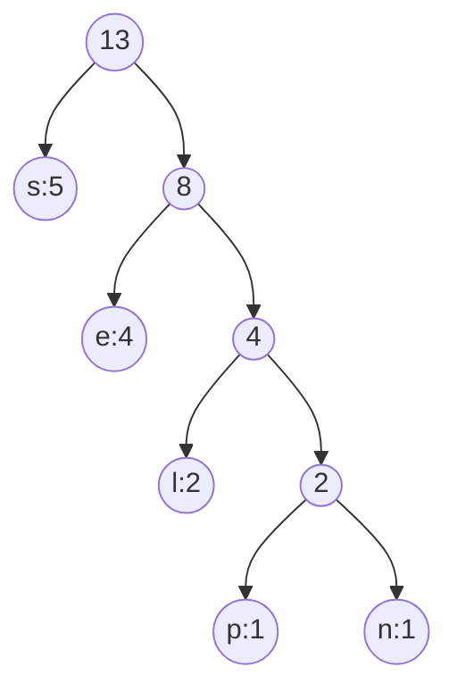

Text Compression
- Each letter maps to binary code
	- 0 for left child
	- 1 for right child
- Huffman encoding
	- Run time: O(n + d x log(d))
		- n: size of text
		- d: number of distinct characters
		- PQueue implemented through a heap


#TuteSheet 
Question 1
```
| Char | s | l | e | p | n |
| Freq | 5 | 2 | 4 | 1 | 1 |

Total: 13
```

Question 2:



s: 0, e: 10, l: 110, p: 1110, n: 1111

spell
0 1110 10 110 110

Question 3:
pens

Question 4:
Scheme 2 or 4
