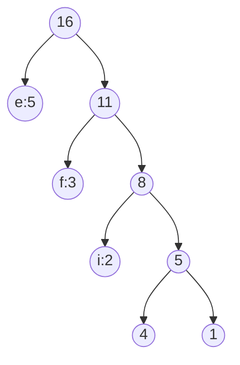

Question 6:
expected case: no collisions
put()
- hashing E O(1)
- indexing E O(1)
- add a node/update a key E O(1)

worst case: every single element collides
put()
- hashing E O(1)
- indexing E O(1)
- search through the chaining E O(n)

Question 7:
balanced = height of left child and right child differs by at most 1
completed = all levels except last is full and
	last level node as far let possible
```
Node | A | B | C | D |
Bal? | Y | Y | N | Y |
Comp?| Y | Y | N | N |
```

Question 8:
(a)
Array Representation for any rank:
	left child at 2i + 1
	right child at 2i + 2
		root of tree at rank 0
```
| 0 | 1 | 2 | 3 | 4 | 5 | 6 | 7 | 8 | 9 | 10 | 11 | 12 | 13 | 14 |
| 1 | 3 | 2 | 5 | 7 | 4 | 8 | x | x | 9 | x  | 6  | 5  | x  | 9  |
```

(b) 
5 3 7 9 1 6 4 5 2 8 9 

Question 9:
Terribly space inefficient
Worst case: O(2^n) in space

Heaps are by definition complete

Question 10:
(a)
2D Hash Table
- (i, j) pairs as keys -> value
Lexicographical ordering 1D ordering of pairs 
- ordering by ascending i first (1, 2) < (2, 2)
- tie-break on ascending j (1, 2) < (1, 3)

(b)
2D hash table O(IJ)
AVL O(n)
- n = no. of mapping

Question 11:
(a)
Queue: {} 
Visited: {C, B, F, E, A, G, D}
Correct visited order:
- {C, B, D, F, E, A, G}

(b)
Visited: {C, B, F, D, A, E, G}

(c)
Prims:
- start with a cloud add the smallest edge connect to the cloud
A, E, F, C, D, B, G

(d)
Kruskal's:
- no cloud add smallest weighted edge anywhere
A, E,

Question 12:
oops i missed

Question 13:
AADB, AD, CBBA, CCB, CCC, CDA

Question 14:
bf <= d + 1
depth first search = m + 1
min(O(dm)), O(n)
node = root
for char in search_word
	search children of node
	if char in any children
		node = child
		continue
	else return false
return true

Question 15:
```
| e | f | c | t | i | v | l | n |   |
| 5 | 3 | 1 | 1 | 2 | 1 | 1 | 1 | 1 |
Total: 16
```




correct tree: check phone

