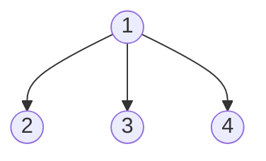
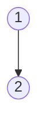
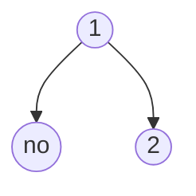
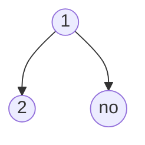
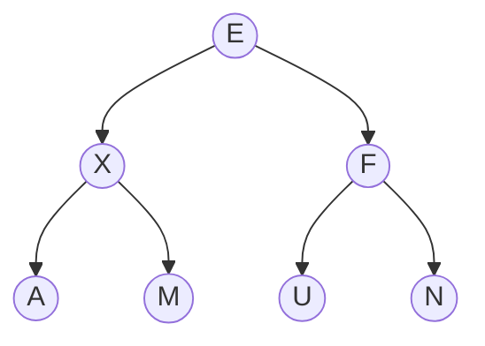
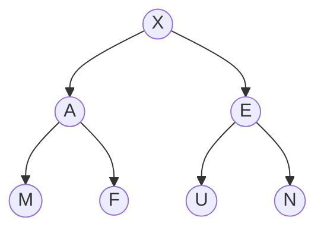
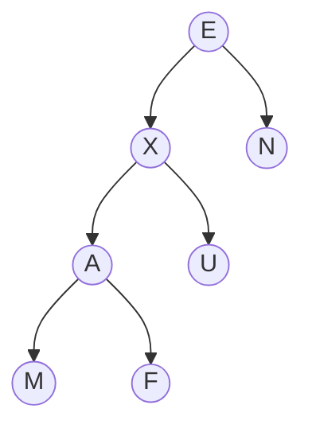
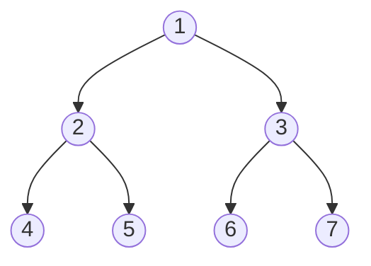

#define Stacks
- Last in First Out (LIFO)
- Stack of plates 
	- Take the stack from the top down
- Operations -> S. ___
	- push(e) add
	- pop - takes out the top plate
	- top or peek
	- is_empty
	
#define Queues
- First in First Out (FIFO) 
- Operations -> Q.___
	- enqueue(e)
	- dequeue -> keep moving the start/head of the array
		- when the start of the array reaches the end, the original start becomes the next spot in the queue and the end becomes next to the current head
	- more
- Array implementation
	- f: index of the front of the queue
	- r: index of the rear of the queue
	- dequeue -> keep moving the start/head of the array
		when the start of the array reaches the end, the original start becomes the next spot in the queue and the end becomes next to the current head
- Performance
	- N: Max Size
	- n: Elements currently in structure
	- Include Table
- Limitations
	- Maximum size of stack can not be changed

#define Trees
Tree Basics
- Hierarchical data structure
- Consists of nodes with parental-child relationships

Tree Terminology
- Root
- Internal Node
	- Has at least one child
- External Node/Leaf
	- Does not have children
- Ancestors of a node
	- parents **double check**
- Descendants of a node
	- children **double check**
- Level
	- Generation, one per depth
- Depth
	- Number of descendants from root
	- Dependent on the specific node
	- Different subtrees can have different depth
- Height
	- Number of ancestors form leaf
	- Dependent on the specific leaf
	- Different subtrees can have different heights
		- Take the largest height

Tree ADT
- General methods
	- **make table**

Tree Traversal
- Visits all nodes in a tree
- Options (theoretical)
	- Pre Order
		- root, left, right: node is visited before descendants
	- In Order
		- left, root, right
	- Post Order
		- child before the parent
- Options (Practical)
	- Pre order
		- flag to the left of each node
	- In order
		- flag down of each node
	- Post Order
		- flag to the right of each node
	- Start from left of root, go around the outside of the tree, *and go to the right of the root?*

Binary Trees
- Full level
	- level i contains 2^i nodes
- Complete Tree
	- for height h
	- levels 0 ... h-1 are full
	- leaves are as far left as possible
	- Properties
		- n: number of nodes
		- e: number of external nodes
		- i: number of internal nodes
		- h: height
		- h = O(log(n))
			- when at least 2 nodes
		- n = sigma [i=0 to h] 2^i
		- n = 2^(h+1) -1
		- n + 1 = 2^(h+1)
		- logBASE2(n+1) = h + 1
- Proper/Full Binary Tree
	- complete -> leaves are as far left as possible
	- proper/full -> every node has two children (except for children)
	- they are not mutually exclusive, trees can be complete but not proper and vice versa
	- Properties
		- e = i+1
		- n = 2e - 1
		- h <= i
		- e <= 2^h
		- h >=logBASE2(e)
		- h >=logBASE2(n+1)-1

#TuteSheet Q1-5
Q1) Stacks and queues
(a) *push:* add to empty queue (Q1) **-> O(1)**
		take everything from other queue (Q2) out and add to Q1 **->*O(n)**
	*pop:* dequeue from the queue with *content* **-> O(1)**
	Alternative
	*push:* enqueue to "active" queue **-> O(1)**
	*pop:* dequeueing all except the last enqueue o the other queue make that queue active **-> O(n)**
	return the last element in original queue O(1)
(b) *enqueue:* push to input Stack (S1) **-> O(1)**
	*dequeue:* if output stack not empty, pop **-> O(1)**
				else pop all from input stack and push to output stack **-> O(n)**
				Every time we do this, we get n "good" calls $$\frac{O(n)}{n} = {O(1)}$$

Q2) Trees
(a) More than two nodes

(b)

(c)

(d)

(e) not possible

(f) *do rest later*

Q3) Binary Tree
(a) no -> level 3 not full
(b) yes
(c) 0
(d) 2
(e) 3
(f) 4
(g) 31 + 3 x 95 - 2 + / 374 - x 6 + -
(h) 
inorder: 3+1x3/9-5+2-3x7-4+6

Q4) Auxiliary data structure
	- Every time a number is encountered we push to stack
	- Every time an operator is encountered, pop 2x, calculate and push result to stack
	- 1 + 3 = 4

Q5)

Appendix
![[Pasted image 20230822130847.png]]
