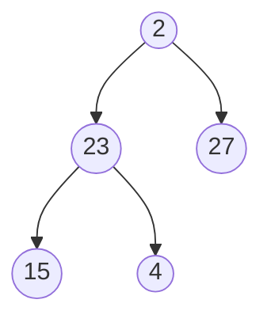
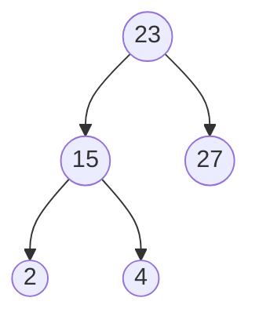

Priority Queues
- Queue but first one out is highest **priority** (lowest key value)
- Each Entry
	- Key: The priority, 0 is the highest priority, 1 is next

#Heaps
Complete Binary Tree
- Consider heap height properties

Heap Order
- the parent is of higher priority than the child
- key(v) => key(parent(v))

Last Node is rightmost node of the lowest level

Insert into a heap
- Up Heap
	- O(log n)
- Swap node k with parent until:
	- reaches the root, or
	- node whose parent has a key less than or equal to k
- Down Heap
	- After removeMin() heap order maybe violated :. down heap
	- O(log n)
	- Steps
		- swap root node with last node
		- remove the last node (which used to be root node)
		- restore heap order (down heap)
- Array Based Heap Implementation
	- n nodes in a n array
	- For rank i:
		- left child: 2i + 1
		- right child: 2i + 2
	- Insert: at index n
	- Remove: n - 1
	- Up heap & down heap: swap array elements
- Priority Queues using Heaps

#HeapSort
- For n times
	- Create a *Max Heap*
		- Max Heap: Parent priority < Child priority
	- Swap root
	- Remove last node
	- Down heap to restore Max Heap Order
- Unsorted list(n)
- n x add elements to a heap -> n x O(log n) = O(n log n)
- heap
- n x remove highest priority and add to list -> n x O(log n) = O(n log n)
- sorted list

Heap construction
- Merge 2 heaps
- *insert image*
- O(n) run time *pg383 of textbook for proof*
- check for violations

#TuteSheet 
Q1)
a) size of array = number of nodes
	7 for full binary tree
b) [1, 4, 7, 5]
	[1, 4, 7, 5, . , . , .]

Q2) 
a) [5 4, 7, 1, wa, wa, wa, wa]
	swap 1 and 5 and cut off 1, since there is a heap order violation (4 and 5) we swap 4 and 5
b) [4, 7, 5, 3]
	insert 3, heap order violation (swap 3 and 5), another heap order violation (swap 3 and 4)
c) Insert 6 no heap order violation
d) swap 6  and 3 (6 not 5 because right most node on lowest level) heap order violation 
e) [5, J, wa, wa, L, wa, wa]
f) [5, J, wa, wa, L, wa, wa] -> [G] ?
g) [J, wa, wa, L, wa, wa, G]
h) [J, H, wa, L, wa, wa, G]
i) [H, wa, L, wa, wa, G, wa]
j) [wa, L, wa, wa, G, wa, wa]

Q3)
max heap (left most lowest level is lowest number, highest node is biggest number)

c) need to know all values in advance

Q4) 

[23, 15, 17, 2, 4]

5)
[23, 15, 17, 2, 4]
[4, 15, 17, 2, 23]
[17, 15, 4, 2 | 23] -> 23 can stay where it is (sorted)
[15, 2, 4 | 17, 23]
[4, 2, | 15, 17, 23]
[2 | 4, 15, 17, 23]
[2, 4, 15, 17, 23] -> all sorted now

O(n log n)