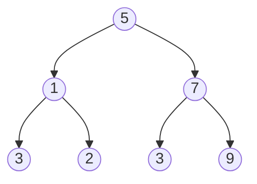

Maps
- key value pairs
- unordered
- unique keys
- sentinel value (null), (none)
	- return null if value is not in the map
	- can not store null as an entry
- Map ADT
	- commands, functions
- Simple List Based Map
	- Unsorted doubly linked list
	- get and remove run in O(n) time
	- put in O(n) instead of O(1

Sets, Multisets & Multimaps
- Set: Unordered collection of elements, without duplicates

Hash Tables
	Problems
	- List based maps are O(n) to remove, get, and put
		- put it linear time as we do not allow duplicate keys

Basic Hash Table
- n elements in an array of size N
- keys are integers from 0 to N-1
- Store the value at index k
- Example:
	- Pairs in the below map <1, D> 
	- *insert image*

Hash Codes
- convert a key of any type to an index in the hash table
- common hash codes:
	- component sum
		- hash collisions
	- polynomial accumulation
		- h = 'h' x k + 't' x k^2
			- where k is a constant
	- cyclic shift

Compression Function
- Compress a hash code
- *insert cone image*
- Process
	- key: unique
	- (hash function) -> 
		- hash code: hopefully unique
		- compression function ->
			- hash value: corresponds to array index collisions possible
- Functions
	- Division
		- h(x) = x mod N
	- Multiple, Add & Divide
		- h2(x) = ((ax + b) mod p) mod N

Collision Handling
- Separate Chaining
	- using array: [0, 1, 2, 3], [1] -> a -> b -> c 
- Linear Probing
	- put a in [1], b in [2], c in [3]
- Quadratic Probing
- Double Hashing

Hashing
- Worst case: O(n)
	- Many collisions
- Expected Case: O(1)
	- No collisions

Load Factor
- how full the table is 

*double cash sign this*
- load factor(alpha) = n/N
- where n is number of elements (k-v) pairs
- where N is array size

- expected number of probes:
	- 1/1-alpha

Binary Search Trees
- Searching
	- to find key k (eg. 4)
		- trace from the root node down the tree
- Insertion
	- assume key k is not in BST
	- once reached leaf node expand the leaf into two more nodes
- Delete
	- Assume key k is in the BST
	- Steps
		- Trace down to find key k
		- Remove node k and replace it with the next node, node v
			- 75: L 90 (had to go left from 90)
			- 62: R 62 (had to go right from 62)
		- Reconnect the tree: v's subtrees
			- follow the rules mentioned in above step
- Performance Analysis
	- Finding, inserting, and deleting
		- Worst case: O(n)
		- Average case: O(log n)
		- state of tree

#TuteSheet 
Q1)
- Row 1 put(44, e)
	- 2 x 44 + 7 = 95
	- 7 - (44 mod 7) = 5
	- 95 mod 9 = 5
	- Bucket: 5
- Row 2 put(13, e)
	- 2 x 13 + 7 = 33
	- 7 - (13 mod 7) = 1
	- 33 mod 9 = 6
	- Bucket: 6
- Row 3 put(89, e)
	- 185
	- 2
	- 5
	- Bucket: 5
- Row 4 remove(44)
	- 95
	- 5
	- 5
	- Bucket: 5
- Row 5 remove(89)
	- 185
	- 2
	- 5
	- Bucket: 5

[0, 1, 2, 3, 4, 5, 6, 7, 8]
- 4 -> 12
- 5 -> 44
- 6 -> 13
- 5 -> 89 
- remove 44 in bucket 5
- remove 89 in bucket 5

(a) Separate chaining (ignoring remove)
[<4, 12>, <(5, 44), (5, 89)>, <6, 13>]
	linked list in bucket 5
(b) linear probing
[<4, 12>, <5, 44>, <6, 13>, <7, 89>]
	5 is full -> go to 6
	6 is full -> go to 7
	when removing 44 replace 44 with DEL -> keep searching until you find 89 -> replace 89 with DEL
(c) double hashing
	(h(k) + jd(k)) mod(N)
	when there is no collision j = 0
	when there is j = 1
	if another j+=1
[<4, 12>, <5, 44>, <6, 13>, <7, 89>]
	when 89 ->
		185 + 1 x 2 = 187
		187 mod 9 = 7
	Deletion is similar to linear probing (replace with DEL)

Q2)
Need to change the compression function

Q3) Separate Chaining
[ , , , , , ]
-> (a, v) -> (b, v)
-> (c, v) -> (d, v)
return [a, b, c, d]

Loop through array O(N)
Loop enough chains O(n)
add to return O(n)

open addressing
[ , (a, v), (b, v), , (c, v), (d, v)]
	return [a, b, c, d]

Loop through array O(N)
add to return O(n)
	O(N + n) -> n <= N -> O(n)

Q4)

*look at photos on phone*
- remove 1 and replace 1 with 2, continue tree
 - main things:
	 - go left if less than node
	 - go right if bigger than node

Q5)
(a)