AVL Trees
- balanced binary search tree
- Balanced:
	- for every internal node:
		- left subtree & right subtree
		- height difference is at most 1
	- |height(x.left) - height(x.right)| <= 1
- Finding the imbalanced node
	- *insert image or example*
- Insert into an AVL tree
	- insert node like in a binary search tree
	- tri-node (restructuring to restore smth)
- Tri-node Restructuring: Intuition
	- Select first unbalanced node x such that
		- |height(left) - height(right)| > 1
	- Right-Right imbalance
- Delete from an AVL Tree
	- remove from tree as if a binary search tree
	- from the deleted node, move up to the first unbalanced node
	- some other step
- Performance
	- Height: O(log(n))
	- Minimum number of nodes in an AVL Tree: n(h) = 2^((h-1)/2)
	- Space: O(n)

Splay Trees
- *Nearly Balanced* binary search tree
	- no rules on height. that is, h is O(n)
- Find a node
	- like binary search tree
	- "splay" the node
- Splaying
	- moves the most recently accessed/inserted node to the root
	- Steps
		- select the node x we want to splay from
		- select **parent** of x
		- if it exists select parent of that parent (i.e **grandparent** of x)
	- Zig-Zig
		- rotate 90 anticlockwise
	- Zag-Zag
		- rotate 90 clockwise
	- Zig-Zag
		- built like >
	- Zag-Zig
		- built like <
	- Insert into Splay
		- Splay Operation 1:
		- 10 on the left but now on the right (?)
			- 7 splay operation on slides
	- Remove from a Splay Tree
		- *image on tutorial slides*

#TuteSheet 
Question 1
Binary tree built like a stick (highest tree possible)

Normal BSTs - no constraint on height, can degenerate to O(n) for insert search and delete

Question 2
Add 10:


Add 12:
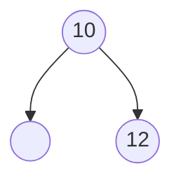
Add 14:
Balance Violation:
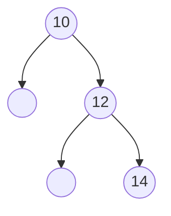
Fix:
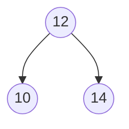

Add 15:
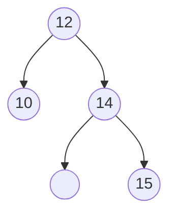
Add 23:
Balance violation
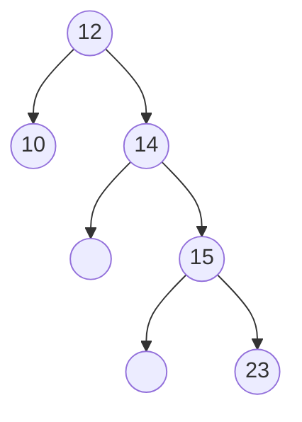
Fix
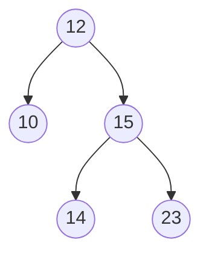

**not solved for 32**
Add 32
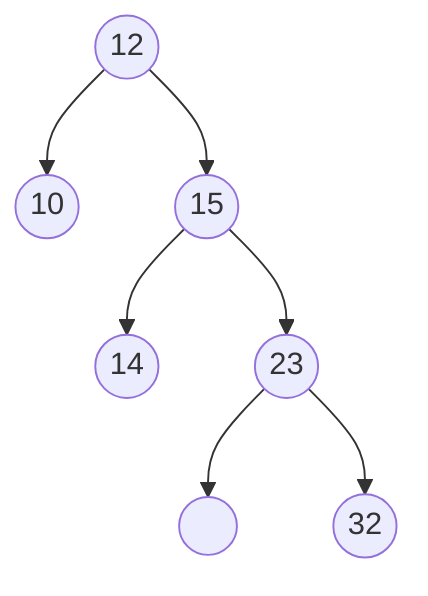

**solved imbalance**
Delete 15
Delete 32
	(2 solutions for delete 32)

Question 3 (do it yourself ~baka) *photo on phone*
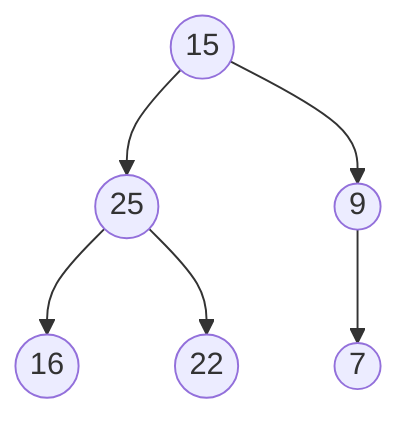


Question 4 -> invisible char (ㅤ)
Add 20:


Add 10:
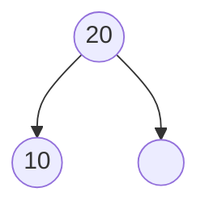
Make 10 the root
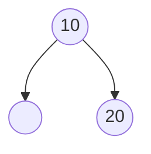

Add 5:
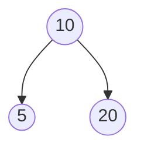

Make 5 the root
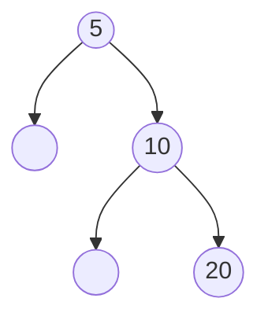

Add 7:

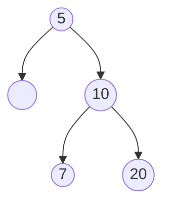
Make 7 the root
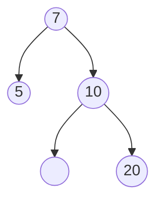

Add 12:
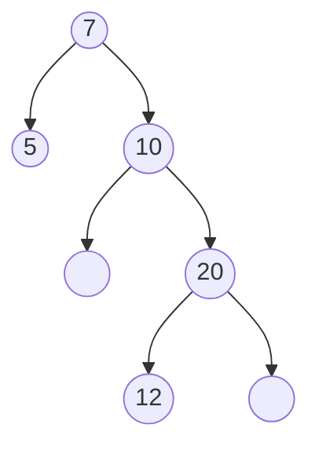


Make 12 the root
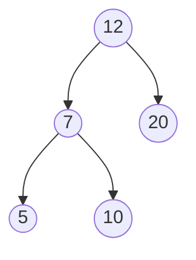

Add 8:
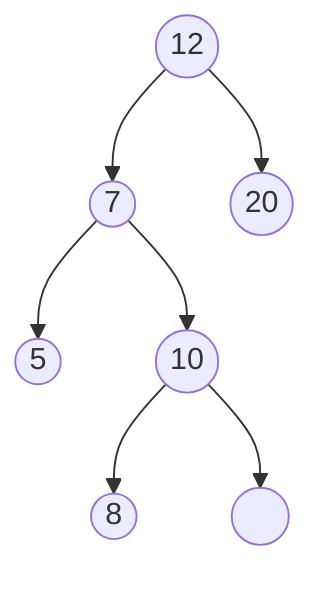

Make 8 the root
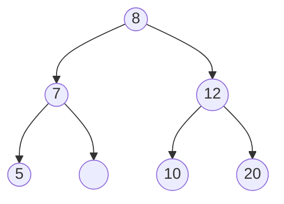

Delete 10:
```mermaid
graph TD;
id1((8)) --> id2((7));
id1((8)) --> id3((12));
id2((7)) --> id4((5));
id2((7)) --> id5((ㅤ));
id3((12)) --> id6((ㅤ));
id3((12)) --> id7((20));
```

splay the parent of the deleted node
```mermaid
graph TD;
id1((12)) --> id2((8));
id1((12)) --> id3((20));
id2((8)) --> id4((7));
id2((8)) --> id5((ㅤ));
id4((7)) --> id6((5));
id4((7)) --> id7((ㅤ));
```

Delete 5
```mermaid
graph TD;
id1((12)) --> id2((8));
id1((12)) --> id3((20));
id2((8)) --> id4((7));
id2((8)) --> id5((ㅤ));
```

Splay the parent of the deleted node
```mermaid
graph TD;
id1((7)) --> id2((ㅤ));
id1((7)) --> id3((8));
id3((8)) --> id4((ㅤ));
id3((8)) --> id5((12));
id5((12)) --> id6((ㅤ));
id5((12)) --> id7((20));
```


Question 5 *i took a photo*