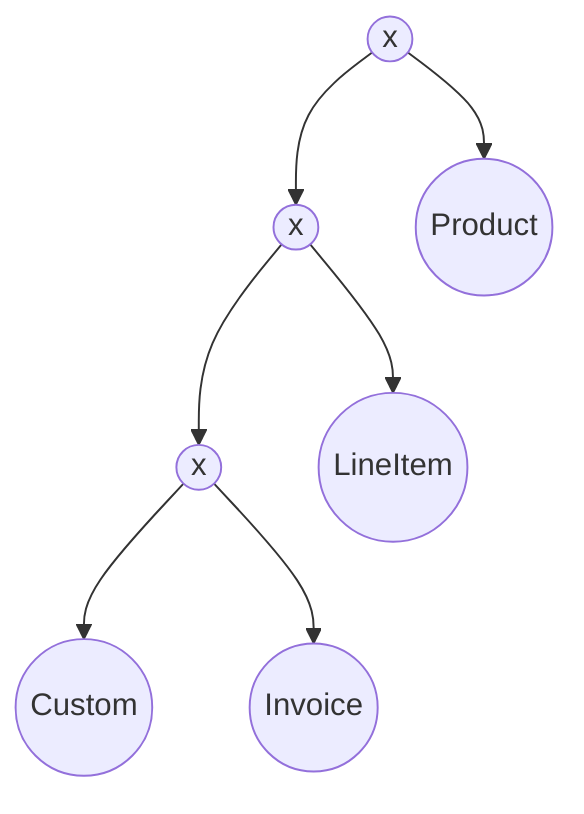

Exercise 1
Part A

Exercise 2
A)
(Join E and D) and then join F

B)
Using [(E JOIN D) JOIN F]
PROJECTION(E.Did)[Selection(E.hobby) = camping(E)]
PROJECTION()

C)
E = Table size = 5000
There are 2 floors, we want floor = 1
No. of tuple returned = 5000x0.5 = 2500
F table size = 5000
tuple return = 5000

(F JOIN D) first results in 5000 
(E JOIN D) results in 2500

As we want the most restrictive we use (E JOIN D) first then join F

Exercise 5
PROJECT...
	select ...
	select ...
	goes into the first x

Push down the tree
![[Pasted image 20231005114951.png]]